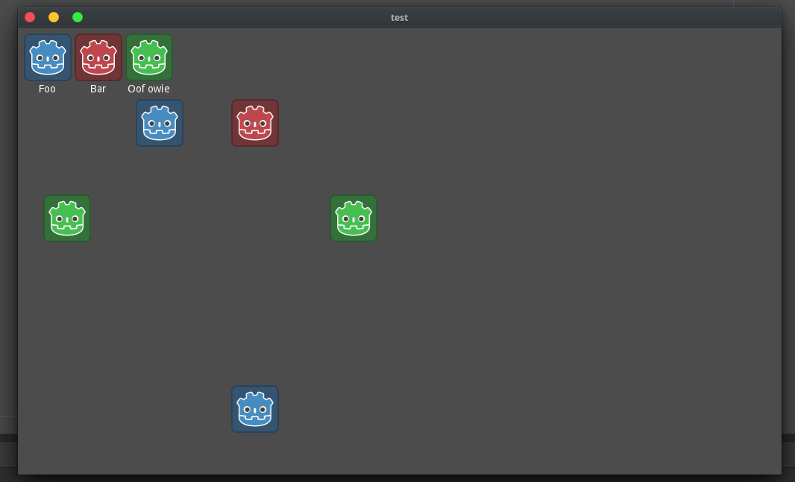

# godot_json
Example project for loading json data and using it in-game

What it does
---
The Game.gd script loads two json files, icons and creeps. It adds the icons into a grid with icon and labels based on the json, and then it adds creeps to the world with sprites and locations based on the json.

The creeps are animated because it was more interesting and only took a minute to add.

(idk why the gif is laggy ¯\\\_(ツ)_/¯)
